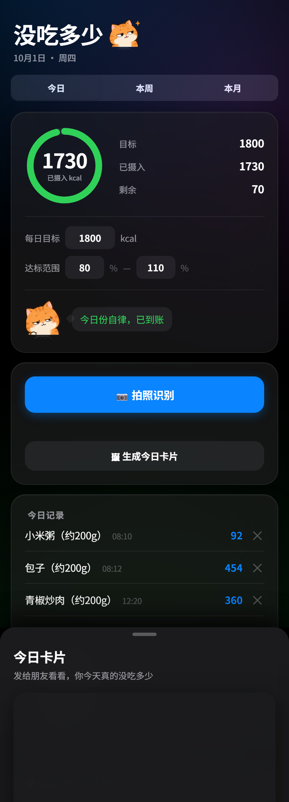
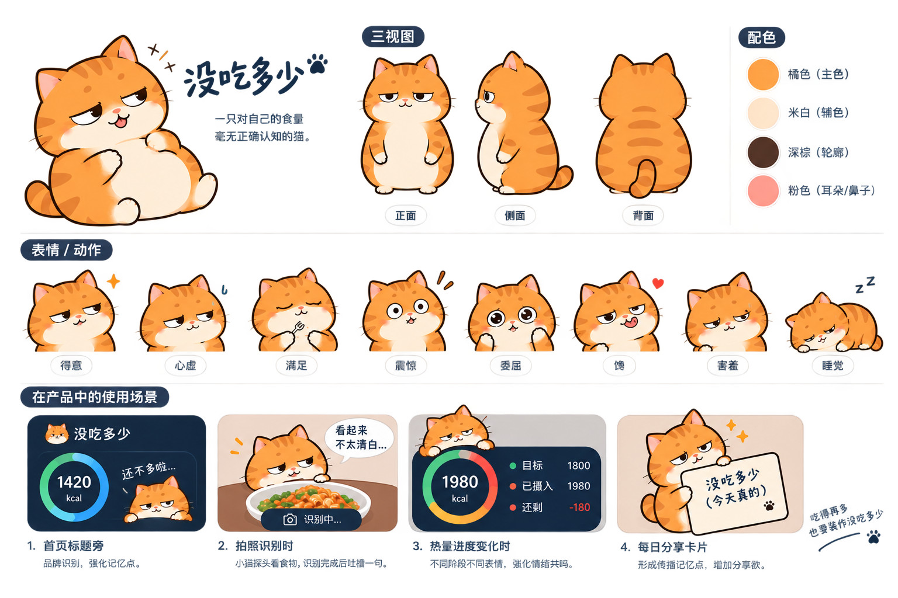
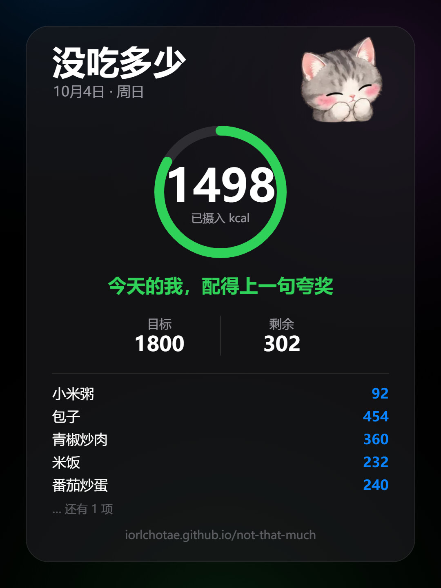
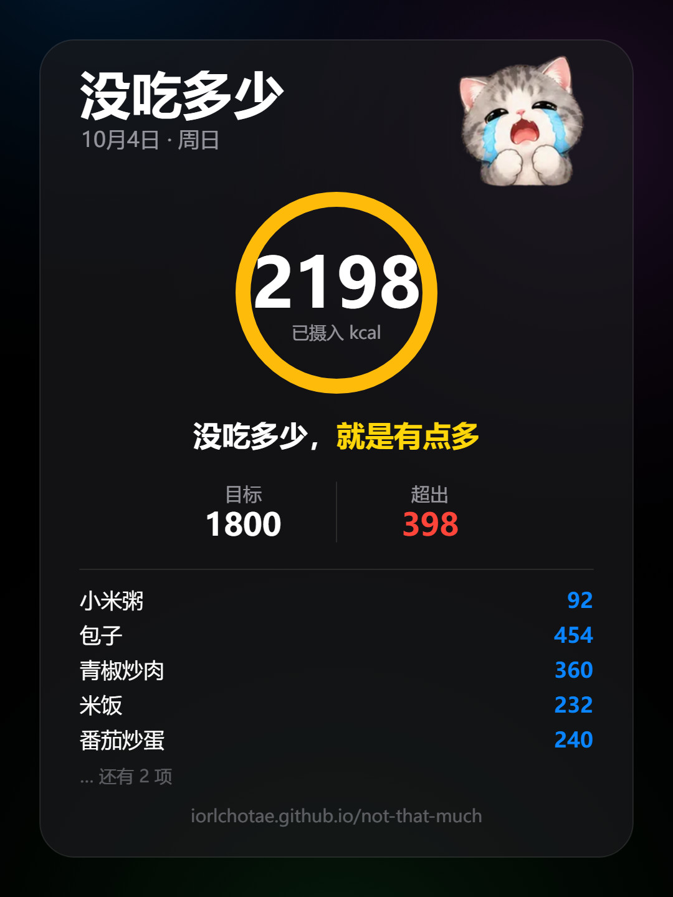
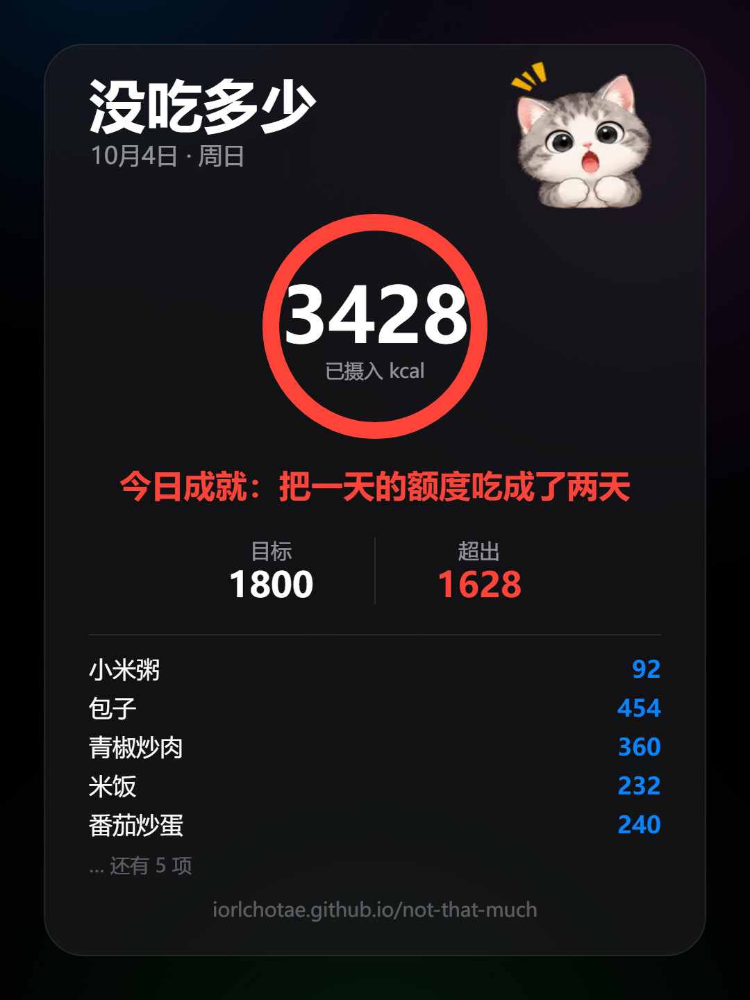

# 没吃多少 (Not That Much) · Photo Calorie Tracker

[中文](README.md) · **English**

Point your camera at a meal. An AI names the dishes, the calories are computed locally,
and you immediately see how much of today's budget is left.

A **single-file web app**: no build step, no backend, no account. Your data stays in your
own browser.

> **Live demo**: https://iorlchotae.github.io/not-that-much/
>
> **First time? Start here → [`新手教程.md`](新手教程.md)** (Chinese, ~3 minutes).
> There are two paths: one that is **completely free**, and one that is faster and more
> accurate but needs a ¥10 top-up. The guide covers both.



## The name

Open the app and the first thing you read is 「没吃多少」 — *"I barely ate anything."*
Directly underneath, a ring reads **1730 kcal**.

The headline is lying and the number is calling it out. That joke doesn't need to be
written down; it lands the moment you open the app. People on a diet are world-class
liars, so the lie became the product name.

The repository is `not-that-much` for the same reason.

## Features

| View | What's in it |
| --- | --- |
| Today | Ring progress, photo recognition, today's log (portions editable and deletable), adjustable daily goal and target range, share-card export |
| Week | Weekly total, 7-day bar chart (tap a bar for that day), trend arrow vs. last week, daily average / days on target |
| Month | Calendar heatmap (tap a day for details), monthly trend line (goal line, today highlighted), daily average / days on target / days logged |
| Share card | One tap for a 1080×1440 portrait image with the day's items, the cat, and a self-deprecating line — ready to save or share |

The UI follows Apple's "Liquid Glass" language: `backdrop-filter` frosted panels, large
corner radii, segmented controls, automatic light and dark mode.

## The character: 就一口

A small cat with **no accurate sense of how much she eats**.

Her name is 「**就一口**」 — *"just one bite"* — because that is the lie every dieter
tells. You know exactly what you're doing when you say it, and that is precisely what
this app exposes every day: **she says "just one bite", the card says 2198.**

Her lifelong motto is printed on the wide version of the share card:

> **Eat as much as you like — just act like you barely ate.**

**Palette**: grey (tabby), cream (face and paws), dark grey (outline), pink (ears and nose).

The nine expressions map to the app's states:

| State | Expression | She says |
| --- | --- | --- |
| Nothing logged yet | Asleep | Haven't touched a thing today |
| Low intake (blue / cyan) | Smug | Plenty of room left～ |
| On track (white) | Calm | All normal, keep it up |
| Past halfway (orange) | Craving | Halfway… starting to feel tempted |
| Nearing the goal (orange) | Nervous | Just one last push |
| On target (green) | Shy | I really didn't eat much today |
| Over (yellow / orange) | Upset | Don't blame the food, blame my mouth |
| Hidden tier (red · 3000+) | Shocked | That number… I'd call the police |
| Recognising | Peeking | This looks a little suspicious… |

She appears in four places, each with a different job:

| Where | Why |
| --- | --- |
| Next to the app title | Brand recognition |
| In the calorie ring card | The expression follows today's state, with a speech bubble |
| During photo recognition | She peeks at the plate, then comments once it's done |
| On the share card | The thing that decides whether anyone passes it on |

All 24 expressions:



### Sticker pack

The same character is also a **24-sticker set** in [`stickers/`](stickers):

- **Gallery**: https://iorlchotae.github.io/not-that-much/stickers/ (long-press to save on mobile)
- **24** is a standard tier on the WeChat sticker platform (8 / 16 / 24 / 32 / 40):
  main 240×240, thumbnail 120×120, cover 240×240, chat icon 50×50, banner 750×400, all transparent
- The 24 poses: shocked / smitten / calm / guilty / cool / bye / angry / craving / asleep /
  surprised / puzzled / crying / eating / shy / hopeful / smug / tongue-out / nervous /
  turned away / peeking / grumpy / dozing / stunned / hugging
- Full list and submission order: [`stickers/文案对照表.md`](stickers/文案对照表.md)

## Share card

Tap 「🖼 生成今日卡片」 after a meal and it exports a **1080×1440** PNG (3:4, the portrait
size 小红书 uses).

**The colour is a thermometer from cold to hot**, driven by *intake ÷ goal*:

| Progress | Colour | Meaning |
| --- | --- | --- |
| 0% | 🔵 Blue `#0a84ff` | Plenty of room |
| 35% | 🩵 Cyan `#32ade6` | Steady |
| 80% | 🟢 Green `#30d158` | **Start of the on-target band** |
| 110% | 🟡 Yellow `#ffd60a` | End of the band, now over |
| 135% | 🟠 Orange `#ff9f0a` | Over by a fair bit |
| 160%+ | 🔴 Red `#ff453a` | Time to call someone |

Green is anchored to the on-target band, so one glance at the colour tells you where the
day stands without reading a number.

**The copy follows the progress bar.** Each step is *goal ÷ 9* (with the default goal of
1800 that works out to **one step per 200 kcal**), and it gets steadily less in control:

```
Haven't touched a thing → Opened the day, still restrained → Holding steady, no problem
→ All normal, keep it up → Still defensible at this point → Halfway… starting to feel tempted
→ My hands are disobeying me → Almost there, just one last push → One bite away, hold on
→ [on target] I really didn't eat much today
→ [over] I didn't eat much, it's just a lot
→ [hidden · 3000+] That number, I'd call the police
```

Each step has 4–5 lines, rotated by a **hash of the date**: the same day always shows the
same line (reopening the card doesn't reshuffle it), and it changes the next day.

The three states, as rendered:

**On target**


**Over**


**Hidden tier (3000+)**


## How it works

```
photo → canvas downscale to 800px long edge / JPEG q0.8 → base64
      → POST to the chosen AI provider (OpenAI-compatible chat/completions)
      → returns "dish,grams" → alias normalisation → local FOOD_DB (97 entries, kcal per 100g)
      → add to today's intake → localStorage
      → render the share card (Canvas 2D)
```

All of it lives in one `index.html`: no dependencies, no framework, no build. The food
database, the alias table and the copy library are plain objects and arrays in the file —
adding a dish or rewording a line means editing the relevant constant.

## Running locally

Opening `index.html` in a browser is enough (`localStorage` works over `file://`).
If you'd rather serve it:

```bash
python3 -m http.server 4173
# open http://127.0.0.1:4173
```

Then: 「⚙️ 配置 AI 服务」 at the bottom of the page → pick a provider → paste an API key
→ 「📷 拍照识别」.

> Step-by-step instructions (signing up, opening the free account, where to keep the key)
> are in [`新手教程.md`](新手教程.md) (Chinese).

## Good to know

- **It needs a network connection**, and an API key from one of two providers. You supply
  the key; this repository contains none.

  | | [Agnes 3.0 Flash](https://platform.agnes-ai.com) | [DeepSeek](https://platform.deepseek.com/api_keys) |
  | --- | --- | --- |
  | Cost | **Free** (input and output are currently $0) | ¥10 top-up to start |
  | Accuracy | 17/18 | 18/18 |
  | Median latency | 2115 ms | 108 ms |
  | Tokens per image | 516 | 237 |

  Measured on the same 18 Chinese-dish photos, with the same prompt and the same food
  database. Agnes is free but rate-limits: several photos in quick succession will ask
  you to wait. Both are far quicker than typing it in by hand. Switch providers in the
  app's settings; each provider's key is remembered separately.

- **The API key is stored in your browser's `localStorage`** in plain text. That's the
  trade-off of a pure front-end app: fine for personal use, but anyone you share it with
  has to enter their own key. Don't save one on a shared computer.
- **Photos are uploaded to the AI provider you choose** for recognition. The food log
  itself never leaves your device. Share cards are only exported when you ask.
- **The calories are estimates.** The model guesses portion sizes, and the database holds
  typical values per 100g — the same dish varies enormously by recipe (300–500 kcal/100g
  for braised pork is all defensible). This tool is for **spotting trends**, not for
  weighing and accounting.
- Known limits: a single photo only recognises the one to three main dishes; portion
  estimates skew large sometimes; accuracy dips on mixed Chinese dishes.

## Licence and disclaimers

**MIT** (see [`LICENSE`](LICENSE)) — use it, change it, redistribute it, including
commercially, as long as you keep the copyright notice.

This project is not affiliated with DeepSeek or Agnes; it only calls their public APIs.
The calorie figures are rough estimates within common public knowledge, offered for
reference only. They are not nutritional or medical advice.
