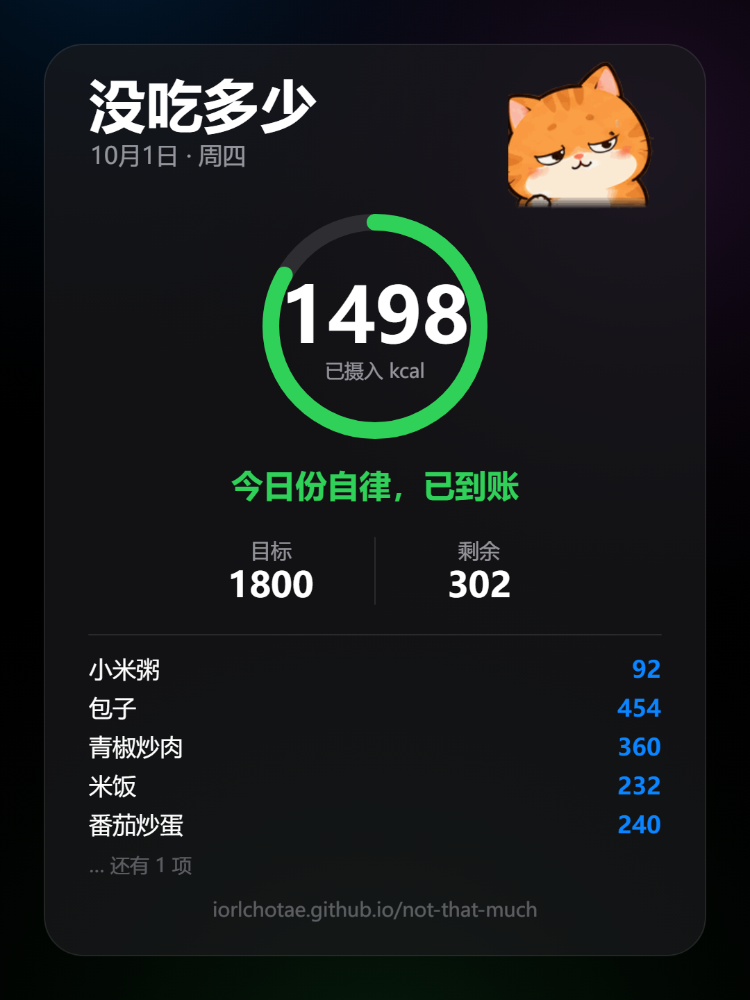
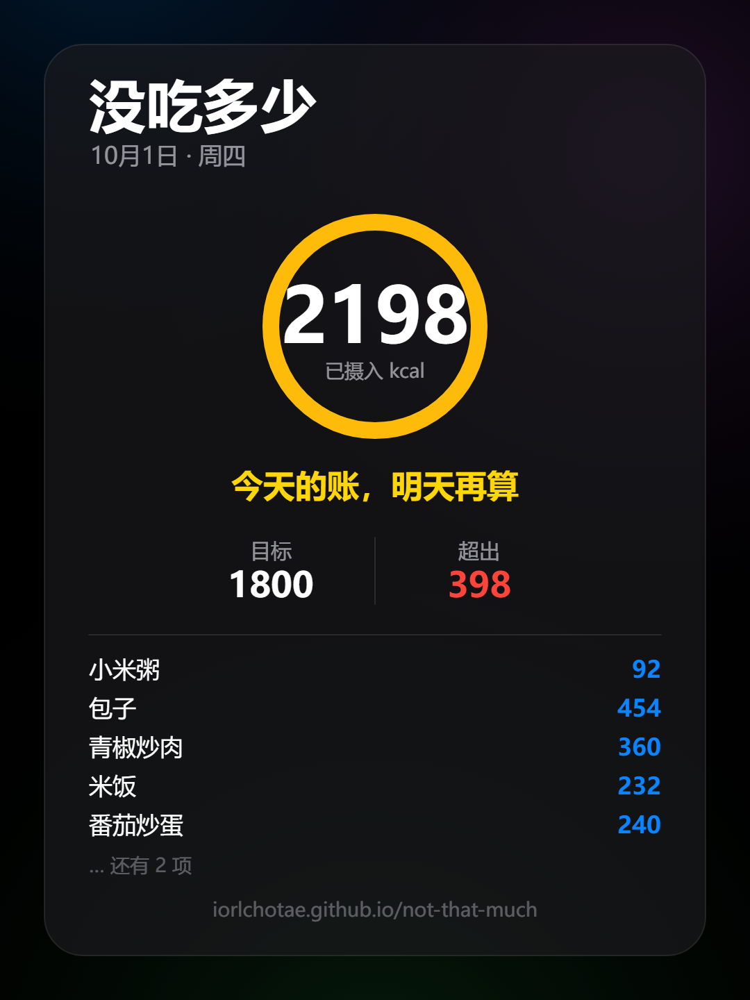
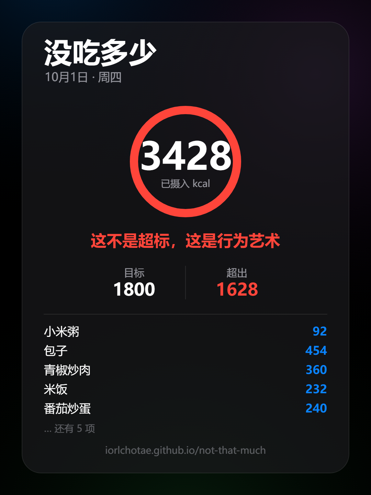

# 没吃多少 · Photo Calorie Tracker

对着饭菜拍一张照，AI 认菜名，本机算热量，立刻看到今天还剩多少额度。

一个**单文件网页应用**：没有构建步骤、没有后端、没有账号。数据只存在你自己的浏览器里。
自备一个 AI 的 API Key 就能用（应用内有引导，**有免费的一家**），每张照片识别约 237–516 tokens。

> **在线试用**：https://iorlchotae.github.io/not-that-much/
>
> **第一次用？看这个 → [`新手教程.md`](新手教程.md)**，三步拿到 Key，大约 3 分钟。
> 简单说：去 [platform.deepseek.com](https://platform.deepseek.com) 充 10 元 → 建一个 API Key →
> 粘进页面底部的「⚙️ 配置 DeepSeek API」。

## 名字的由来

打开这个应用，顶部写着「没吃多少」，紧跟着下面一个环形图显示 **1730 kcal**。

标题在撒谎，数据在打脸 —— 这个笑话不用写在文案里，打开就成立。
减肥的人最擅长的事就是骗自己，所以干脆把这件事做成了产品名。


## 角色：就一口

一只**对自己的食量毫无正确认知**的小猫。

它叫「**就一口**」——因为这是每个减肥的人都会说的那句谎。
说「就一口」的时候，心里其实清楚得很；这正好是这个 App 每天都在拆穿的事：
**它嘴上说"就一口"，卡片上写着 2198。**

它这一辈子的行动纲领，写在分享卡片的横版图上：

> **吃得再多，也要装作没吃多少。**

表情里那个「再吃一口？」的犹豫脸，配这个名字是天生的。

整只猫的设定在这儿 —— 24 个表情，以及它在产品里出现的四个位置：


**配色**：灰（虎斑）、奶白（脸和爪子）、深灰（轮廓）、粉（耳朵和鼻子）。

> 这版是**柔光写实风**，不再是上一版的纯色块，所以内联格式也跟着换了：
> 调色板 PNG 在这种连续渐变上要 **35KB／只**，WebP 只要 **12KB**。
> 九个表情内联后占 111KB，`index.html` 从 151KB 涨到 **189KB**。

八个表情分别对上什么状态：

| 状态 | 表情 | 它说 |
| --- | --- | --- |
| 今天还没记录 | 睡觉 | 今天还一口没动 |
| 低摄入（蓝 / 青） | 得意 | 还很宽裕～ |
| 进度正常（白） | 满足 | 一切正常，继续保持 |
| 开始过半（橙） | 馋 | 一半了……开始有点心动 |
| 接近目标（橙） | 心虚 | 就剩最后一哆嗦 |
| 达标（绿） | 害羞 | 今天真的没吃多少 |
| 超标（黄 / 橙） | 委屈 | 不怪食物，怪我嘴 |
| 隐藏档（红 · 3000+） | 震惊 | 这个数字…建议直接报警… |
| 识别中 | 探头 | 看起来不太清白… |

它出现在四个位置，每个位置的分工都不一样：

| 位置 | 干什么 |
| --- | --- |
| 首页标题旁 | 品牌识别，强化记忆点 |
| 热量环形卡里 | 表情跟着当天状态走，配一句对话气泡 |
| 拍照识别时 | 探头看一眼盘子：「看起来不太清白…」，认完再吐槽一句 |
| 每日分享卡片 | 形成传播记忆点，决定别人愿不愿意转发 |

### 表情包《就一口》

同一批角色也做成了**一套 24 张**的表情包，放在 [`stickers/`](stickers)：

- **在线画廊**：https://iorlchotae.github.io/not-that-much/stickers/ （手机上长按即可保存）
- **24 张**是微信表情开放平台的正规规格（8 / 16 / 24 / 32 / 40），
  主图 240×240、缩略图 120×120、封面 240×240、聊天页图标 50×50、详情页横幅 750×400，全部透明底
- 24 个动作：得意 / 心虚 / 满足 / 震惊 / 馋 / 睡觉 / 刷手机 / 大口吃 / 偷看 / 吃饱了 / 超标了 / 算了吧 /
  喝饮料 / 再来一口 / 清盘 / 自我安慰 / 生气 / 委屈 / 打滚 / 享受 / 盯着 / 装酷 / 好吧… / 生活很美好
- 每张配的文案延续 App 的文案库语气，所以表情和 App 里会说的话是同一套声音
- 完整清单与平台提交顺序见 [`stickers/文案对照表.md`](stickers/文案对照表.md)


## 功能

| 视图 | 内容 |
| --- | --- |
| 今日 | 环形进度、拍照识别、当日记录（可删）、每日目标与达标范围可调、生成分享卡片 |
| 本周 | 本周总摄入、7 天柱状图（点柱看当天详情）、对比上周趋势箭头、日均 / 达标天数 |
| 本月 | 日历热力图（点格子看详情）、月度趋势折线（含目标虚线、今日高亮）、日均 / 达标天数 / 记录天数 |
| 分享卡片 | 一键生成 1080×1440 竖图，带当日明细、橘猫和一句自嘲文案，可直接保存或分享 |

界面参考 Apple 的「液态玻璃」语言：`backdrop-filter` 毛玻璃、大圆角、分段控件、自动深色/浅色模式。

## 分享卡片

拍完照点「🖼 生成今日卡片」，导出一张 **1080×1440**（3:4，小红书竖图尺寸）的 PNG。

**颜色是一条从冷到热的温度计**，横轴是「已摄入 ÷ 目标」：

| 进度 | 颜色 | 含义 |
| --- | --- | --- |
| 0% | 🔵 蓝 `#0a84ff` | 还很宽裕 |
| 35% | 🩵 青 `#32ade6` | 稳步推进 |
| 80% | 🟢 绿 `#30d158` | **达标区间起点** |
| 110% | 🟡 黄 `#ffd60a` | 达标终点，开始超 |
| 135% | 🟠 橙 `#ff9f0a` | 超得有点多 |
| 160%+ | 🔴 红 `#ff453a` | 建议直接报警 |

绿色锚定在达标区间，所以扫一眼颜色就知道今天什么状态，不用读字。

**文案跟着进度走**，档距 = 目标 ÷ 9（默认目标 1800 时正好**每 200 卡一档**），越吃越收不住：

```
今天还一口没动 → 开张了，还算克制 → 稳住了，问题不大 → 一切正常，继续保持
→ 到这儿都还说得过去 → 一半了……开始有点心动 → 手有点不听使唤了
→ 快了，就剩最后一哆嗦 → 就差这一口了，忍住
→ 【达标】今天真的没吃多少
→ 【超标】没吃多少，就是有点多
→ 【隐藏 · 3000 卡以上】这个数字，建议直接报警
```

每个档位有 4–5 条文案，用**日期做哈希种子轮换**：同一天永远同一条（重开卡片不跳），隔天才换。
一共 51 条，实测 60 天内每档都能轮换到全部条目，没有死文案。

三个状态的实拍：

**达标**


**超标**


**隐藏档（3000 卡以上）**


## 工作原理

```
拍照 → canvas 压到长边 800px / JPEG q0.8 → base64
     → POST api.deepseek.com（deepseek-flash，detail:low）
     → 返回「菜名,克数」→ 别名归一化 → 查本地 FOOD_DB（97 条，每 100g 热量）
     → 累加今日摄入 → localStorage
     → 生成分享卡片（Canvas 2D 绘制）
```

全部逻辑在一个 `index.html` 里：无依赖、无框架、无构建。食物库、别名表、文案库都是文件里的普通对象/数组，
想加菜或改文案直接改对应的常量即可。


## 本地运行

直接用浏览器打开 `index.html` 就能跑（`localStorage` 在 `file://` 下可用）。
想用本地服务：

```bash
python3 -m http.server 4173
# 打开 http://127.0.0.1:4173
```

然后：页面底部「⚙️ 配置 DeepSeek API」→「🔑 去 DeepSeek 获取 API Key」→ 粘贴保存 →「📷 拍照识别」。

> 详细的图文步骤（怎么注册、为什么必须充值、10 元能用多久、Key 放哪安全）
> 都在 [`新手教程.md`](新手教程.md)。

## 使用须知

- **需要联网**，且需要一个 AI 的 API Key。两家可选，Key 由使用者自己提供，本仓库不含任何密钥：

  | | [Agnes 3.0 Flash](https://platform.agnes-ai.com) | [DeepSeek](https://platform.deepseek.com/api_keys) |
  | --- | --- | --- |
  | 花钱 | **完全免费**（输入输出目前都是 $0） | 要先充 10 元 |
  | 准确率 | 17/18 | 18/18 |
  | 中位延迟 | 2115ms | 108ms |
  | 单张 tokens | 516 | 237 |

  > 同一套 18 张中餐照片、同一个提示词、同一份食物库，实测结果。
  > Agnes 免费但有速率限制，连拍多张会要求等待。
  > 切换服务商在应用底部的配置里，两家的 Key 会分别记住。
- **API Key 保存在浏览器 `localStorage` 里**（明文）。这是纯前端方案的取舍：自己用没问题，
  要给别人用就得让每个人填自己的 Key。请不要在公共电脑上保存。
- **照片会上传给所选的 AI 平台** 做识别。饮食记录本身只存在本机，不会上传。分享卡片是你主动导出的。
- **热量是估算**。模型给的是粗略克数，食物库是每 100g 的常见值，同一道菜不同做法差异很大
  （红烧肉 300–500 kcal/100g 都说得通）。这个工具是用来**看趋势**的，不是称重记账。
- 已知限制：单张照片只识别主要的一到三道菜；模型份量估算有时偏大；中餐混合菜的识别准确度会波动。

## 授权与声明

本项目采用 **MIT 许可证**（见 [`LICENSE`](LICENSE)）—— 你可以自由使用、修改、再发布，
包括商用，只要保留版权声明。

本项目与 DeepSeek 官方无关，仅调用其公开 API。
食物热量数据为公开常识范围内的粗略估算值，仅供参考，不构成营养或医疗建议。
