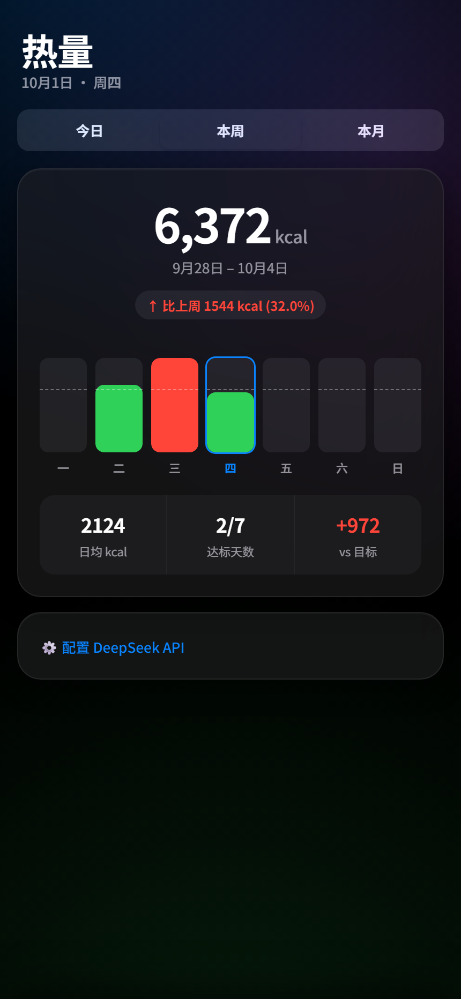
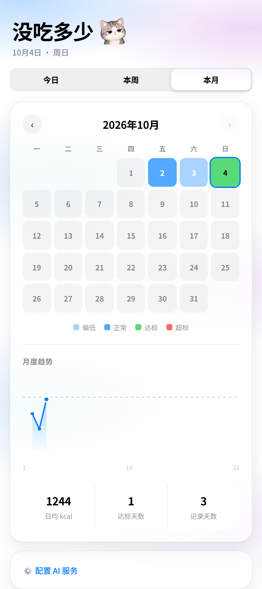

# 拍照记热量 · Photo Calorie Tracker

对着饭菜拍一张照，AI 认菜名，本机算热量，立刻看到今天还剩多少额度。

一个**单文件网页应用**：没有构建步骤、没有后端、没有账号。数据只存在你自己的浏览器里。
自备一个 DeepSeek API Key 就能用（应用内有引导），每张照片识别约 268 tokens。

> **在线试用**：https://iorlchotae.github.io/photo-calorie-tracker/
>
> 首次使用请点页面底部「⚙️ 配置 DeepSeek API」，填入你自己的 Key。


## 为什么做这个

市面上的热量 App 大多有两步：拍照 → 在 100 万条食物库里挑一个最像的 → 手动调分量。
坚持几天就烦了。这个项目反过来：

- **不做数据库匹配**，直接让多模态模型看图报菜名和克数
- **中餐优先**，针对「青椒炒肉」「番茄炒蛋」这类混合菜调过提示词
- **打开就是今日额度**，不是让你翻周报

设计上追求「拍完 2 秒内看到今日剩余额度变化」。

## 功能

| 视图 | 内容 |
| --- | --- |
| 今日 | 环形进度、拍照识别、当日记录（可删）、每日目标与达标范围可调 |
| 本周 | 本周总摄入、7 天柱状图（点柱看当天详情）、对比上周趋势箭头、日均 / 达标天数 |
| 本月 | 日历热力图（点格子看详情）、月度趋势折线（含目标虚线、今日高亮）、日均 / 达标天数 / 记录天数 |
| 详情弹层 | 从底部弹出某天全部记录，带达标状态徽章 |

界面参考 Apple 的「液态玻璃」语言：`backdrop-filter` 毛玻璃、大圆角、分段控件、自动深色/浅色模式。




## 工作原理

```
拍照 → canvas 压到长边 800px / JPEG q0.8 → base64
     → POST api.deepseek.com（deepseek-flash，detail:low）
     → 返回「菜名,克数」→ 别名归一化 → 查本地 FOOD_DB（97 条，每 100g 热量）
     → 累加今日摄入 → localStorage
```

全部逻辑在一个 `index.html` 里：无依赖、无框架、无构建。食物库和别名表都是文件里的普通对象，
想加菜直接改 `FOOD_DB` 即可。

### 两个踩过的坑（都写进代码注释了）

**1. `deepseek-flash` 默认开启思考模式，`max_tokens` 给小了会返回空字符串。**
最初写 `max_tokens: 100`，100 个 token 被思维链全部吃光，`content` 是空的 —— 用户拍完照只会看到「未识别到食物」。
现在是 `thinking: { type: 'disabled' }` + `max_tokens: 512`：这是「看一眼报菜名」的简单任务，不需要思考，
还顺带省掉约 1/3 的 token。

**2. 不归一化菜名会被错配成别的菜。**
模型对番茄炒蛋有相当比例会返回「西红柿炒鸡蛋」，朴素的子串匹配会命中「鸡蛋」（144 kcal），既认错菜又算错热量。
所以 `findFood()` 的顺序是**先查别名 → 再精确 → 最后才子串匹配**。

## 本地运行

直接用浏览器打开 `index.html` 就能跑（`localStorage` 在 `file://` 下可用）。
想用本地服务：

```bash
python3 -m http.server 4173
# 打开 http://127.0.0.1:4173
```

然后：页面底部「⚙️ 配置 DeepSeek API」→「🔑 去 DeepSeek 获取 API Key」→ 粘贴保存 →「📷 拍照识别」。

## 使用须知

- **需要联网**，且需要一个 DeepSeek API Key（[开放平台](https://platform.deepseek.com/api_keys)）。Key 由使用者自己提供，本仓库不含任何密钥。
- **API Key 保存在浏览器 `localStorage` 里**（明文）。这是纯前端方案的取舍：自己用没问题，
  要给别人用就得让每个人填自己的 Key。请不要在公共电脑上保存。
- **照片会上传给 DeepSeek** 做识别。饮食记录本身只存在本机，不会上传。
- **热量是估算**。模型给的是粗略克数，食物库是每 100g 的常见值，同一道菜不同做法差异很大
  （红烧肉 300–500 kcal/100g 都说得通）。这个工具是用来**看趋势**的，不是称重记账。
- 已知限制：单张照片只识别主要的一到三道菜；模型份量估算有时偏大；中餐混合菜的识别准确度会波动。

## 授权与声明

本项目与 DeepSeek 官方无关，仅调用其公开 API。
食物热量数据为公开常识范围内的粗略估算值，仅供参考，不构成营养或医疗建议。
